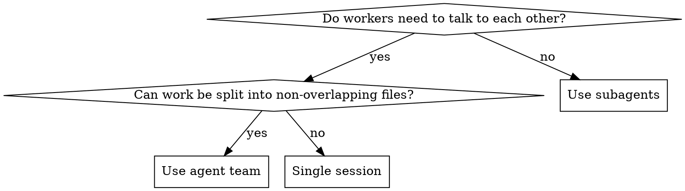

# Writing Team Agents

## Overview

Agent teams are **not subagents with extra steps**. Teams have shared task lists, direct inter-agent messaging, and self-coordination. If your design has a hub-and-spoke pattern where the lead manually collects and pastes results between agents, you've designed subagents — use the Agent tool instead.

**Core principle:** Teams excel when teammates need to communicate with each other, challenge findings, and self-coordinate. If workers just report results back, use subagents.

## Prerequisites

Agent teams are experimental. Enable via `CLAUDE_CODE_EXPERIMENTAL_AGENT_TEAMS=1` in settings.json or environment.

## When to Use Teams vs Subagents



**Best for:** parallel code review, competing hypotheses debugging, cross-layer features, research from multiple angles.

**Not for:** sequential tasks, same-file edits, work where only the final result matters.

## Quick Reference

| Concept | Subagent | Agent Team |
|---------|----------|------------|
| Communication | Report back to caller only | Teammates message each other directly |
| Coordination | Caller manages everything | Shared task list, self-claiming |
| Context | Inherits or receives prompt | Own window, loads CLAUDE.md automatically |
| Lead's role | Manually routes results | Coordinates, synthesizes — does NOT relay messages |

## The 5 Design Rules

### 1. Design for messaging, not relay

Teammates message each other directly via the mailbox. The lead does NOT need to copy-paste results between agents.

```text
# BAD: Hub-and-spoke (this is just subagents)
"When Agent A finishes, paste its report into Agent B's prompt"

# GOOD: Direct messaging
"After investigating, message your findings to the other teammates.
Challenge any findings that contradict your hypothesis."
```

### 2. Break work into 5-6 tasks per teammate

One monolithic task per agent = no ability to reassign if someone gets stuck. Create granular tasks in the shared task list with explicit dependencies.

```text
# BAD: 1 task per agent
Task 1: "Investigate session expiration" → Agent A
Task 2: "Investigate Redis race conditions" → Agent B

# GOOD: Multiple tasks, self-claimed
Task 1: Find session TTL configuration
Task 2: Audit session.destroy() call sites
Task 3: Check background cleanup jobs
Task 4: Find Redis client configuration
Task 5: Search for non-atomic read-modify-write patterns
Task 6: Check Redis eviction policy
...
```

Teammates self-claim from the shared list. Task locking prevents races.

### 3. Keep spawn prompts focused — CLAUDE.md handles the rest

Teammates automatically load CLAUDE.md, MCP servers, and skills. Don't repeat project context in spawn prompts. Focus on:
- The teammate's specific role/perspective
- What success looks like
- Who to message with findings

### 4. The lead synthesizes — no "synthesizer" teammate

Don't create a dedicated synthesis agent. The lead's job IS synthesis. A synthesis teammate wastes a full context window on work the lead should do.

### 5. Use plan approval for risky work

```text
Spawn an architect teammate to refactor the auth module.
Require plan approval before they make any changes.
```

The lead reviews and approves/rejects plans. Teammates stay in read-only plan mode until approved.

## Team Sizing

- **3-5 teammates** for most workflows
- **5-6 tasks per teammate** keeps everyone productive
- More teammates = more tokens (each is a full Claude instance)
- Three focused teammates outperform five scattered ones

## Features Checklist

When designing a team, consider each:

- [ ] **Display mode**: `in-process` (default, any terminal) or `tmux`/iTerm2 split panes
- [ ] **Plan approval**: require for teammates doing risky implementation
- [ ] **Hooks**: `TeammateIdle` (keep working) and `TaskCompleted` (quality gate)
- [ ] **Task dependencies**: blocked tasks auto-unblock when dependencies complete
- [ ] **Permissions**: all teammates inherit lead's permission mode at spawn
- [ ] **Shutdown**: ask lead to shut down teammates, then clean up the team
- [ ] **One team per session**: clean up current team before starting a new one

## Adversarial Debate Pattern (for debugging)

When investigating bugs with multiple hypotheses, don't just isolate teammates — make them adversarial:

```text
Spawn 3 teammates to investigate the random logout bug. Each owns a
hypothesis. Have them talk to each other to try to disprove each
other's theories, like a scientific debate.
```

This fights anchoring bias. Isolated investigation finds the first plausible explanation and stops. Adversarial debate finds the one that survives scrutiny.

## Common Mistakes

| Mistake | Fix |
|---------|-----|
| Designing hub-and-spoke relay | Use direct teammate messaging |
| One giant task per agent | 5-6 granular tasks with dependencies |
| Creating a "synthesizer" agent | Lead does synthesis |
| Repeating project context in spawn prompts | CLAUDE.md loads automatically |
| Teammates work in same files | Assign clear file ownership boundaries |
| Forgetting cleanup | Always shut down teammates then clean up via lead |
| Thinking teammates lack codebase access | All teammates have full codebase + tool access |
